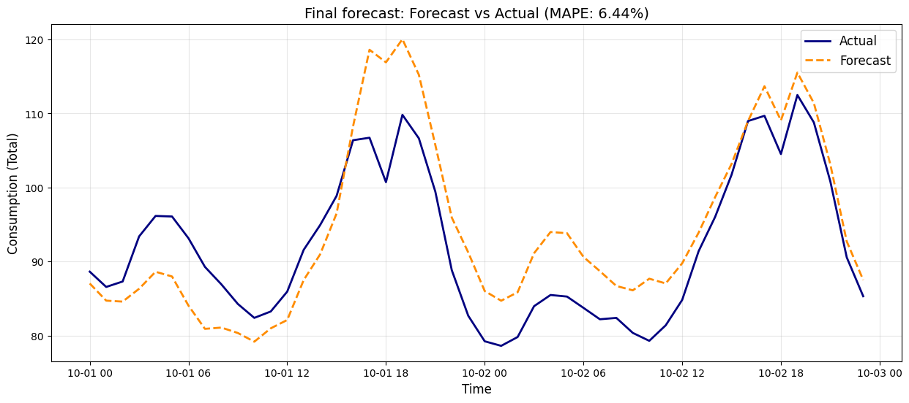

# EnergyForecastFinal

# Energy Consumption Forecasting

This project implements a machine learning pipeline to forecast hourly electricity consumption for various consumer groups 48 hours into the future. It leverages **LightGBM**, robust time-series feature engineering, and astronomical data to achieve accurate predictions.

## Key Features

* **Model:** LightGBM Regressor (Gradient Boosting Machine) optimized for time-series forecasting.
* **Metric:** Mean Absolute Percentage Error (MAPE).
* **Feature Engineering:**
    * **Temporal:** Hour, Day of Week, Month, Season, Year.
    * **Lags & Rolling Windows:** 2-day, 3-day, 1-week, and 1-year lags; Rolling maximums to capture trends.
    * **Solar Data:** Dynamic calculation of Sun Elevation and "Is Sun Up" flags using the `astral` library, based on geographic coordinates of Finnish cities.
    * **Weather:** Temperature, Humidity, Rain, and Wind Speed integration.
    * **Pricing:** 24-hour lagged electricity spot prices.
    * **Group specific:** private/enterprise, type of electricity contract.
* **Validation:** 8-fold Time Series Cross-Validation to prevent data leakage and ensure robustness across different seasons.
* **Forecast Generation:** A complete pipeline to generate a wide-format 48-hour forecast CSV from raw data.

## Installation

1.  Clone the repository:
    ```bash
    git clone [https://github.com/anton-saari/EnergyForecastFinal.git](https://github.com/anton-saari/EnergyForecastFinal.git)
    cd EnergyForecastFinal
    ```

2.  Install the required packages:
    ```bash
    pip install pandas numpy lightgbm astral scikit-learn matplotlib
    ```

## Usage

1.  Ensure all data files are placed in the root directory.
2.  Open the Jupyter Notebook:
    ```bash
    jupyter notebook code.ipynb
    ```
3.  Run all cells to execute the training pipeline and generate the forecast.
4.  **Output:** The script generates `48_hour_forecast.csv`, a wide-format CSV where:
    * **Index:** `measured_at` (Timestamp)
    * **Columns:** `group_id` (Consumer Group IDs)
    * **Values:** Predicted consumption (kWh)

## Methodology

### 1. Data Preprocessing
The pipeline cleans raw data, handles missing values, and merges disparate data sources (weather, price, client info) into a unified time-series dataframe.

### 2. Feature Engineering
To capture the cyclic nature of energy usage, the model uses:

* **Cyclical Encoding:** Months and seasons are treated mathematically to preserve their cyclic nature (e.g., December is close to January).

* **Astronomical Features:** The model calculates the exact sun elevation angle for each location. This helps the model distinguish between a dark winter afternoon and a sunny summer evening.

* **Data Leakage Avoidance:** To prevent data leakage, feature engineering is strictly aligned with the 48-hour forecast horizon. Electricity prices utilize a 24-hour lag, while autoregressive consumption features are lagged by a minimum of 48 hours. Additionally, the model mimics a production environment by training on historical weather actuals and utilizing weather forecasts for future inference.

### 3. Training & Validation
The model is trained using an **8-fold Time Series Split** scheme where each fold represents one month. This ensures the model is tested on "future" data it hasn't seen during training, simulating real-world forecasting conditions. It also makes it easy to analyze the performance of the model in different months.

* **CV Scores across folds (MAPE):** [5.96%, 5.36%, 7.04%, 8.40%, 5.44%, 4.23%, 4.61%, 5.36%]
    * april and may performed the worst, while july and august performed the best.
 
* **CV Score Average (MAPE):** ~5.8%

## Results

* **Final forecasted average MAPE (01.10.2024-02.10.2024):** 6.44%


